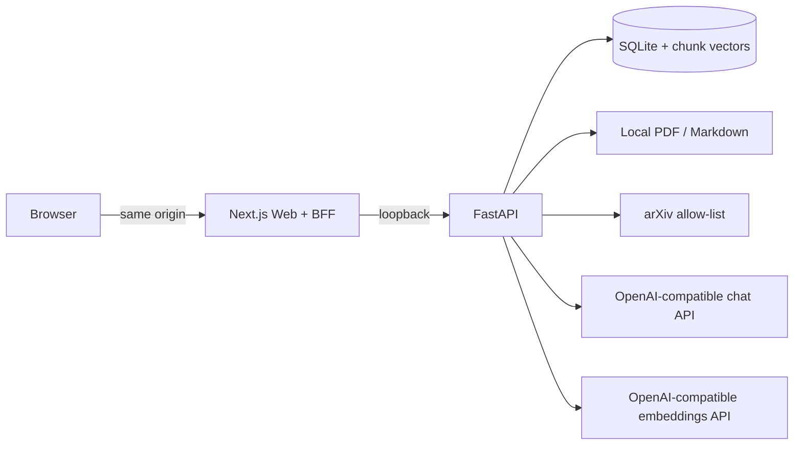

# ScholarMind

ScholarMind 是一个面向 arXiv 论文精读的本机 RAG 应用：安全下载和解析论文，将分块与向量保存在本地数据库，在**单篇论文隔离**的范围内检索，并通过 SSE 返回带 PDF 页码引用的答案。

> 默认面向个人或单团队工作区。共享 Bearer Token 不是完整的终端用户账号系统；公网多用户部署应先接入可信身份层。

## 核心能力

- **开箱即用的本机拓扑**：SQLite、进程内摄取任务、本地文件存储和数据库向量检索，无需启动额外基础服务。
- **OpenAI 兼容协议**：生成调用 `{LLM_BASE_URL}/chat/completions`，嵌入调用 `{EMBEDDING_BASE_URL}/embeddings`；两者可配置不同的地址、Key 和模型。
- **安全摄取**：只接受规范化 arXiv ID/URL，逐跳验证重定向，并限制 PDF 字节数、页数和对象路径。
- **一致状态**：`QUEUED → DOWNLOADING → PARSING → INDEXING → READY/FAILED`；只有文件、分块和嵌入全部成功才会进入 `READY`。
- **隔离检索**：向量与分块持久化在 `paper_chunks`，每次 SQL 检索都强制 `paper_id`，并使用向量/词法混合评分。
- **可追溯问答**：页码/章节引用、上下文预算、防文档提示注入系统指令、OpenAI SSE 增量输出。
- **论文速览卡**：论文就绪后在阅读台顶部生成 TL;DR、背景、贡献、方法、发现、局限与关键术语的中英文速览，支持重新生成。
- **领域检索**：按主题、分类和日期检索 arXiv 摘要，生成带 `[P1]` 来源标记的进展、技术路线、瓶颈与研究机会报告，并可恢复历史图谱。
- **历史会话**：论文问答与领域报告均持久化；刷新后可继续最近会话，也可切换、新建或通过右键菜单删除会话。
- **中英双语界面**：首次按浏览器语言自动选择，支持随时切换并在本地记住偏好。
- **双模式工作台**：Codex 风格的侧栏和输入区，可切换单篇论文阅读与话题探索；包含真实摄取进度、PDF/对话双栏、报告引用跳转和移动端布局。
- **可视化设置**：侧栏底部齿轮打开 `/settings`，分组编辑和搜索 `.env` 配置，包含模型、arXiv、存储、端口及鉴权。密钥支持替换或清除，保存后重启服务生效。

## 本机架构



详细设计和不变量见 [docs/architecture.md](docs/architecture.md)。

## 快速开始

要求：Python 3.11/3.12、Node.js 22+ 和 npm。

### 1. 安装

```bash
python scripts/setup.py
```

脚本会创建 `.venv`、安装后端和前端依赖，并在不存在时把 `.env.example` 复制为 `.env`。

### 2. 配置模型

编辑根目录 `.env`：

```dotenv
# OpenAI-compatible chat completions
LLM_BASE_URL=https://api.openai.com/v1
LLM_API_KEY=your-chat-api-key
LLM_MODEL=gpt-4o-mini

# OpenAI-compatible POST /v1/embeddings
EMBEDDING_BASE_URL=https://api.openai.com/v1
EMBEDDING_API_KEY=your-embedding-api-key
EMBEDDING_MODEL=text-embedding-3-small
```

`BASE_URL` 是 API 根路径，通常以 `/v1` 结尾；应用分别追加 `/chat/completions` 和 `/embeddings`。两组三元组彼此独立，可以指向不同兼容服务。远程嵌入维度会从实际响应推断，不需要手工填写。

如果任意一组三个值全部留空，对应能力会使用可离线运行的本地实现，方便先验证完整链路。

### 3. 启动

```bash
python scripts/start.py --reload
```

访问：

- Web：<http://localhost:3000>
- 话题探索：<http://localhost:3000/research>
- API 文档：<http://localhost:8000/docs>
- 健康检查：<http://localhost:8000/health/ready>

左侧栏可以切换两种工作模式，并打开最近阅读的论文和历史探索。在单篇模式输入 arXiv 编号或链接；话题模式输入研究方向，展开“筛选”可调整分类、日期、排序和论文数。历史探索通过 `/research/{id}` 恢复，选择来源论文的“精读论文”即可进入阅读模式。“新建任务”清空当前输入和展示，已有论文、会话及报告仍保存在历史中。

右键点击侧栏历史条目或论文内的历史会话可打开操作菜单，也可点击条目旁的“…”按钮。删除话题会删除该次检索与报告，删除论文会话会删除该会话的消息；删除当前打开的记录后会回到空白工作区。最近阅读条目提供“从最近阅读中移除”，保留 PDF、索引和论文会话，重新提交同一 arXiv 编号可恢复到列表。菜单支持 `Shift+F10` 打开、`Esc` 关闭，删除失败会显示错误并允许重试。

启动脚本会先执行 Alembic 迁移，再同时启动 FastAPI 和 Next.js；按 `Ctrl+C` 会停止两个子进程。使用构建后的前端运行：

```bash
python scripts/start.py --production
```

也可以只启动一端：

```bash
python scripts/start.py --api-only --reload
python scripts/start.py --web-only
```

本地数据位于 `data/`。删除该目录会清空论文、会话、PDF、Markdown 和向量。

## 质量检查

```bash
make lint
make test
make build
```

或参照 [docs/development.md](docs/development.md) 分别运行 Ruff、Mypy、Pytest、ESLint、TypeScript、Vitest 和 Next.js production build。GitHub Actions 执行同样的本机进程测试和构建，不依赖外部服务。

## 文档

- [架构与不变量](docs/architecture.md)
- [开发环境与测试](docs/development.md)
- [本机部署与升级](docs/deployment.md)
- [运维与故障排查](docs/operations.md)
- [安全模型](docs/security.md)
- [安全漏洞报告](SECURITY.md)

## 技术栈

Python 3.11/3.12 · FastAPI · SQLAlchemy 2 · Alembic · SQLite · OpenAI-compatible HTTP APIs · Next.js 16 · React 19 · TypeScript
