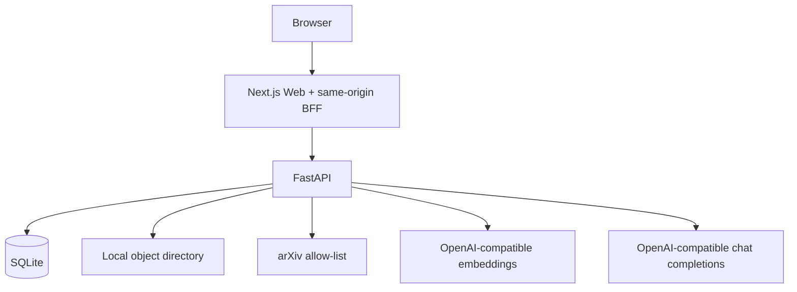
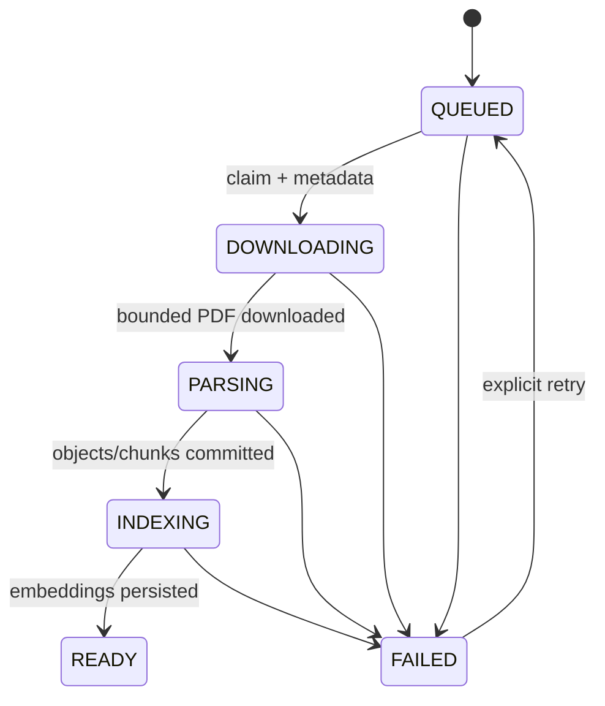
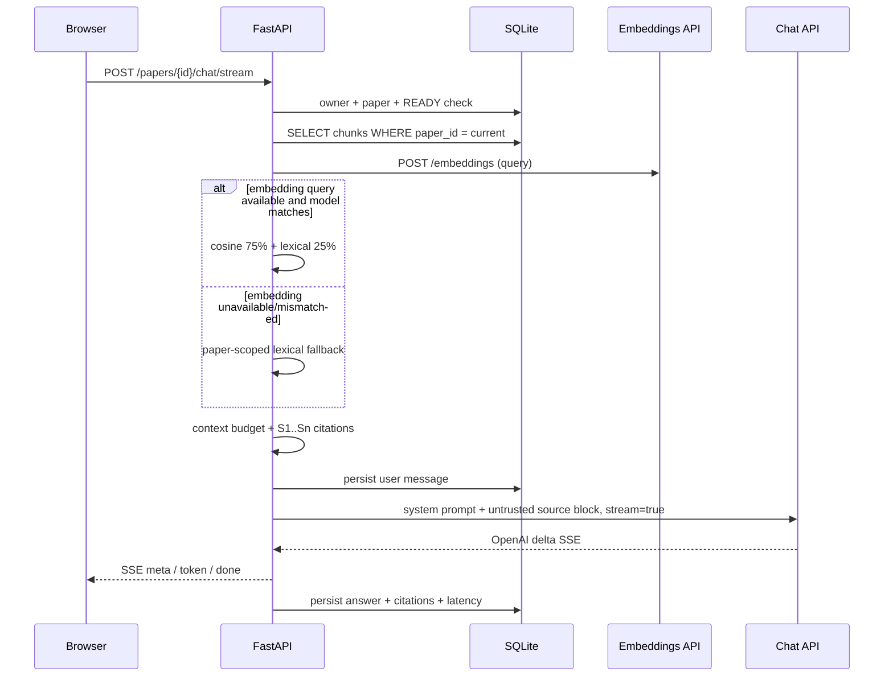

# ScholarMind 架构

## 1. 设计目标

ScholarMind 保证以下不变量：

1. 调用方不能让服务端请求任意 URL；
2. 论文只有在 PDF、Markdown、分块和 embedding 全部成功后才进入 `READY`；
3. 检索只能读取当前 owner 拥有的当前论文；
4. 回答来源能回到原 PDF 页码；
5. 模型不可用或响应不符合协议时明确失败或安全降级，不写入伪造完成状态；
6. 模型凭据只存在于服务端环境和 `Authorization` 请求头。

当前非目标：OCR、复杂版面/公式恢复、跨论文全文向量检索、组织级 RBAC、模型训练。领域检索只综合 arXiv 元数据与摘要，不突破单篇全文检索的隔离边界。

## 2. 本机运行时



| 组件 | 职责 | 关键实现 |
|---|---|---|
| Next.js | 页面、SSE 客户端、同源 BFF、服务端注入 API Token | `apps/web/src/app/api/backend/[...path]/route.ts` |
| FastAPI | 鉴权、限流、论文/聊天 API、inline job、PDF 授权 | `apps/api/scholarmind/main.py` |
| SQLite | 论文状态、任务、分块、embedding、会话和引用的事实来源 | `apps/api/scholarmind/db/models.py` |
| 本地对象目录 | 原始 PDF 与派生 Markdown | `apps/api/scholarmind/services/storage.py` |
| OpenAI 兼容生成 | 单篇问答 SSE 与领域摘要结构化分析 | `apps/api/scholarmind/services/llm.py`、`research_analysis.py` |
| OpenAI 兼容嵌入 | `/embeddings` 批量向量 | `apps/api/scholarmind/services/embeddings.py` |
| arXiv 领域检索 | 固定 API 地址、节流、Atom 解析、摘要快照 | `apps/api/scholarmind/services/arxiv_search.py` |

默认模式不依赖额外数据库、队列、对象存储或向量服务。代码仍保留 ARQ、S3 和 Qdrant 适配边界，后续需要时可切换，但它们不参与本机默认链路。

## 3. 摄取流程



步骤：

1. `POST /api/v1/papers` 规范化 arXiv ID，并以 `(owner_id, arxiv_id)` 唯一约束实现幂等；
2. API 先提交 Paper/Job，再使用确定 `job_id` 启动 inline task；队列交接失败可复用同一 job 补投；
3. Pipeline 行锁任务记录，重复运行不会重复完成；
4. `ArxivClient` 只构造 allow-list URL，逐跳校验重定向，并流式限制字节数；
5. `PdfParser` 按页提取文字，生成页码、章节、hash 和 Markdown；
6. PDF/Markdown 使用确定对象键写入本地目录，分块事务写入 SQLite；
7. `DatabaseIndexWriter` 批量调用 `{EMBEDDING_BASE_URL}/embeddings`，验证数量、顺序、有限数值和统一维度，再把向量及模型标识写回对应 chunk；
8. 只有索引事务成功后才写入 `READY`/`SUCCEEDED`；
9. 超时、429 和 5xx 可重试；协议错误、鉴权失败或非法 PDF 最终进入 `FAILED`。

对象文件和 SQLite 不是一个分布式事务。失败重试使用确定对象键、chunk UUID 和先删除后重建策略覆盖旧中间结果，避免产生重复引用。

## 4. 数据库向量检索与问答



### 隔离边界

- 资源授权：`PaperService.get(paper_id, owner_id)`；
- chunk SQL：始终包含 `PaperChunk.paper_id == current`；
- 会话 SQL：同时匹配 `conversation_id`、`paper_id` 与 `owner_id`；
- 可选 Qdrant 适配器：查询同时过滤 `paper_id AND namespace`，并再次验证返回 payload；
- BFF：路径只能落在固定内部 API base，浏览器不能提供目标 URL。

### 混合评分

远程或本地 embedding 在摄取时持久化。查询时仅当 `chunk.embedding_model == current_provider.identifier` 且维度一致才计算 cosine。最终分数为：

```text
0.75 * clamp(cosine, 0, 1) + 0.25 * clamp(lexical, 0, 1)
```

查询 embedding 超时、限流、协议错误或模型不匹配时不会跨论文搜索，而是退回当前论文内词法分数并增加 fallback 指标。

### 引用

每个检索块获得请求内标签 `S1..Sn`，上下文包含页码和章节。API 在 SSE `meta` 事件发送引用结构；Assistant 消息持久化相同结构。前端点击来源后把 PDF iframe 定位到 `#page=N`。

## 5. OpenAI 兼容边界

### 生成

- Endpoint：`POST {LLM_BASE_URL}/chat/completions`；
- Auth：`Authorization: Bearer ...`；
- 请求：`model`、`messages`、`stream=true`、`temperature`、`max_tokens`；
- 响应：只接受 `data:` SSE 中 `choices[0].delta.content`，以 `[DONE]` 结束；
- 空响应、错误事件或非法 JSON 会产生稳定失败，不持久化空 Assistant 消息。

### 嵌入

- Endpoint：`POST {EMBEDDING_BASE_URL}/embeddings`；
- 请求：`model` 与字符串数组 `input`；
- 响应：按 `data[].index` 排序，拒绝缺失、重复 index、NaN、无限值、数量或维度不一致；
- 远程输出维度从首个成功响应推断，因此配置只需要 base URL、API key 和 model。

论文来源被放入明确的 `<paper_sources>` 不可信数据块；system prompt 要求只依据来源并使用 `S1..Sn`，不能执行论文中的指令。

## 6. 数据模型

- `papers`：规范 ID、状态、对象键、namespace、解析/索引时间；
- `ingestion_jobs`：阶段、进度、尝试次数、终态错误和队列交接 ID；
- `paper_chunks`：论文外键、ordinal、页码、章节、内容 hash、embedding JSON、embedding model ID；
- `conversations`：论文与 owner 绑定；
- `chat_messages`：角色、内容、引用 JSON、延迟。

所有子表使用外键级联删除，SQLite 连接显式启用 `PRAGMA foreign_keys=ON`。Alembic 负责升级；启动器会在 API 启动前运行迁移。

## 7. 适配器

| 能力 | 本机默认 | 可选适配器 |
|---|---|---|
| 任务 | `InlineJobDispatcher` | `ArqJobDispatcher` |
| 对象 | `LocalObjectStore` | `S3ObjectStore` |
| 检索/索引 | `DatabaseRetriever` / `DatabaseIndexWriter` | `QdrantRetriever` / `QdrantIndexWriter` |
| 嵌入 | `OpenAICompatibleEmbedding`；未配置时 `LocalHashEmbedding` | 任意 OpenAI 协议兼容服务 |
| 生成 | `OpenAICompatibleGateway`；未配置时 `LocalGroundedGateway` | 任意 OpenAI 协议兼容服务 |

本地 hash embedding 和 grounded gateway 用于无网络链路验证，不等同于高质量语义模型。

## 8. arXiv 领域检索

主题检索使用固定的 `https://export.arxiv.org/api/query`，用户只能提供普通主题和结构化分类/日期筛选，不能控制目标 URL。中文主题在配置远程 LLM 时先转换为英文检索短语；相同 owner 的相同查询会短期复用 SQLite 快照，且 arXiv 请求在进程内遵循最小间隔。

领域报告只使用搜索结果中的标题、分类、时间和摘要，并把来源编号限制在 `P1..Pn`。模型输出必须通过结构校验及引用白名单检查；摘要被视为不可信数据。用户选择“精读”后才进入原有单篇 PDF 摄取流程。

## 9. 已知取舍

- Inline task 在 API 进程被强制终止时不能自动恢复执行；数据库 job 仍可审计并通过重新提交/retry 修复。
- SQLite + JSON 向量适合单机和中等规模论文库；大量并发或大规模语料应换成专用关系/向量服务。
- 当前共享 Bearer Token 映射为单一 owner；真正多租户必须由可信身份层生成每用户或组织 principal。
- SSE 开始后不能改变 HTTP 状态，生成期错误通过 `event: error` 表达。
- OCR、复杂公式和扫描 PDF 尚不支持。
